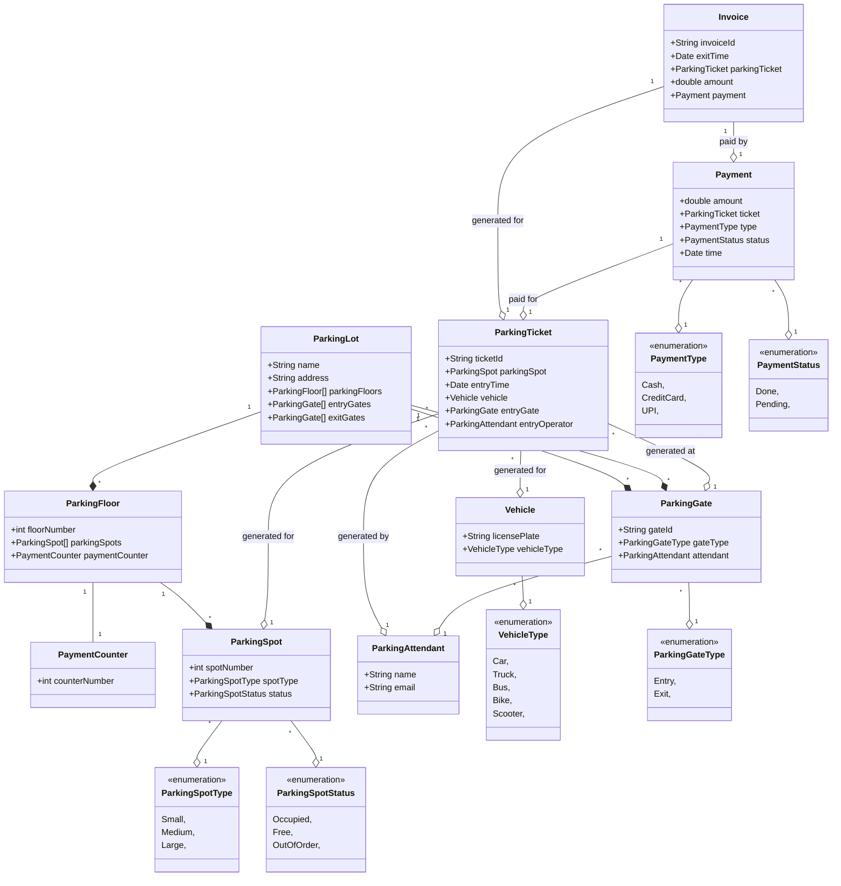

```mermaid
classDiagram
    class ParkingLot {
        +String name
        +String address
        +ParkingFloor[] parkingFloors
        +ParkingGate[] entryGates
        +ParkingGate[] exitGates 
    }

    class ParkingFloor {
        +int floorNumber
        +ParkingSpot[] parkingSpots
        +PaymentCounter paymentCounter
    }

    class PaymentCounter {
        +int counterNumber
    }

    class ParkingSpot {
        +int spotNumber
        +ParkingSpotType spotType
        +ParkingSpotStatus status
    }

    class ParkingTicket {
        +String ticketId
        +ParkingSpot parkingSpot
        +Date entryTime
        +Vehicle vehicle
        +ParkingGate entryGate
        +ParkingAttendant entryOperator
    }

    class Invoice {
        +String invoiceId
        +Date exitTime
        +ParkingTicket parkingTicket
        +double amount
        +Payment payment
    }

    class Payment {
        +double amount
        +ParkingTicket ticket
        +PaymentType type
        +PaymentStatus status
        +Date time
    }

    class Vehicle {
        +String licensePlate
        +VehicleType vehicleType
    }

    class ParkingAttendant {
        +String name
        +String email
    }
    
    class ParkingGate {
        +String gateId
        +ParkingGateType gateType
        +ParkingAttendant attendant
    }

    class ParkingSpotType {
        <<enumeration>>
        Small,
        Medium,
        Large,
    }

    class ParkingSpotStatus {
        <<enumeration>>
        Occupied,
        Free,
        OutOfOrder,
    }

    class PaymentType {
        <<enumeration>>
        Cash,
        CreditCard,
        UPI,
    }

    class PaymentStatus {
        <<enumeration>>
        Done,
        Pending,
    }

    class VehicleType {
        <<enumeration>>
        Car,
        Truck,
        Bus,
        Bike,
        Scooter,
    }

    class ParkingGateType {
        <<enumeration>>
        Entry,
        Exit,
    }

    ParkingLot "1" --* "*" ParkingFloor
    ParkingLot "1" --* "*" ParkingGate : entryGates
    ParkingLot "1" --* "*" ParkingGate : exitGates

    ParkingFloor "1" --* "*" ParkingSpot
    ParkingFloor "1" -- "1" PaymentCounter

    ParkingTicket "*" --o "1" ParkingSpot : generated for 
    ParkingTicket "*" --o "1" Vehicle : generated for
    ParkingTicket "*" --o "1" ParkingGate : generated at
    ParkingTicket "*" --o "1" ParkingAttendant : generated by

    Invoice "1" --o "1" ParkingTicket : generated for
    Invoice "1" --o "1" Payment : paid by

    Payment "*" --o "1" PaymentType
    Payment "*" --o "1" PaymentStatus
    Payment "1" --o "1" ParkingTicket : paid for

    Vehicle "*" --o "1" VehicleType

    ParkingGate "*" --o "1" ParkingAttendant
    ParkingGate "*" --o "1" ParkingGateType

    ParkingSpot "*" --o "1" ParkingSpotType
    
    ParkingSpot "*" --o "1" ParkingSpotStatus
```
