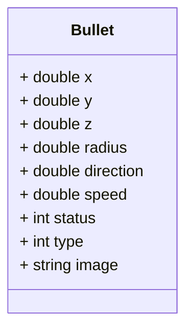
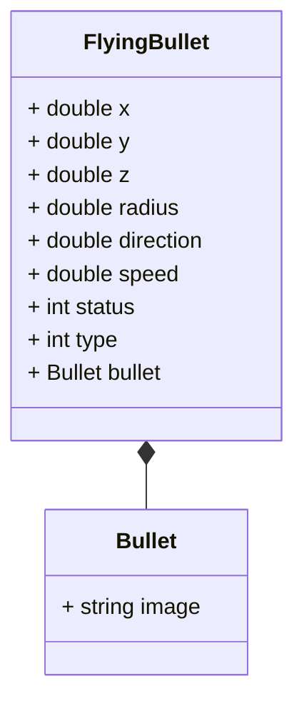

## Flyweight Pattern

> The flyweight pattern is used to reduce the memory footprint of a program by sharing as much data as possible with similar objects.

Today, we again assume the role of game developer and are looking to create a role-playing game like PUBG, counter strike etc. We modeled our game in various classes such as Map, User, Gun and Bullet. We are able to create a functional end to end game. The game works smoothly when you and your friend play it.
So you decide to host a game party to show off your new game. When a lot of players start playing the game, you notice that the game is lagging. You check the memory usage of the game and notice that the memory usage is very high. Each bullet was represented by a separate object containing plenty of data. At some point, when the carnage on a player’s screen reached its climax, newly created particles no longer fit into the remaining RAM, so the program crashed.

Let us take a closer look at the Bullet class.

The memory used by a single bullet instance would be:
* `Double`  - 8 bytes * 6 = 48 bytes
* `Integer` - 4 bytes * 2 = 8 bytes
* `Image` - 1KB

Let us say each person has around 400 bullets and there are 200 people playing the game. The total memory used by the bullets would be 1KB * 400 * 200 = 80MB. This is a lot of memory for just 200 people playing the game. Imagine if the number of bullets increase or the number of players increase. The memory usage would be even higher. For 2000 bullets for 200 players the memory usage would be 800MB.

The major problem here is for each object, the image field consumes a lot of memory. The image is also the same for all the bullets. 

Other parts of a particle’s state, such as coordinates, movement vector and speed, are unique to each particle. After all, the values of these fields change over time. This data represents the always changing context in which the particle exists, while the color and sprite remain constant for each particle.

This constant data of an object is usually called the intrinsic state. It lives within the object; other objects can only read it, not change it. The rest of the object’s state, often altered “from the outside” by other objects, is called the extrinsic state.

The Flyweight pattern suggests that you stop storing the extrinsic state inside the object. Instead, you should pass this state to specific methods which rely on it. Only the intrinsic state stays within the object, letting you reuse it in different contexts. As a result, you’d need fewer of these objects since they only differ in the intrinsic state, which has much fewer variations than the extrinsic.

So our Bullet class will have to be divided into two classes. One class will contain the intrinsic state and the other class will contain the extrinsic state. The extrinsic state will be passed to the methods that need it. 



Now, every bullet will have a reference to the Bullet object. The Bullet object will contain the image field. The FlyingBullet class will contain the extrinsic state. Each bullet does not need to have its own image field. The image field is shared between all the bullets. This way, the memory usage is reduced.

### Implementation
* `Intrinsic state` - The intrinsic state is stored in the flyweight object. It is independent of the flyweight’s context and remains the same for all flyweight objects.

```java
public class Bullet {
    private String image;
}
```
* `Extrinsic state` - The extrinsic state is stored or computed by client objects. It depends on the flyweight’s context and changes with it.

```java
public class FlyingBullet {
    private double x;
    private double y;
    private double z;
    private double radius;
    private double direction;
    private double speed;
    private int status;
    private int type;
    private Bullet bullet;
}
```

* `Flyweight factory` - The flyweight factory is responsible for creating and managing flyweight objects. It ensures that flyweights are shared properly. When a client requests a flyweight, the flyweight factory either returns an existing instance or creates a new one, if it doesn’t exist yet.

```java
public class BulletFactory {
    private static final Map<String, Bullet> bullets = new HashMap<>();

    public Bullet getBullet(BulletType type) {
        ...
    }

    public void addBullet(BulletType type, Bullet bullet) {
        ...
    }
}
```

* `Client code` - The client code usually creates a bunch of pre-populated flyweights in the initialization stage of the application.


### Recap
* The flyweight pattern is used to reduce the memory footprint of a program by sharing as much data as possible with similar objects.
* First we need to identify the intrinsic and extrinsic state of the object.
* The intrinsic state is stored in the flyweight object. It is independent of the flyweight’s context and remains the same for all flyweight objects.
* The extrinsic state is stored or computed by client objects. It depends on the flyweight’s context and changes with it.
* The extrinsic object contains a reference to the flyweight object or is composed of the flyweight object.
* A flyweight factory is responsible for creating and managing flyweight objects. It ensures that flyweights are shared properly. When a client requests a flyweight, the flyweight factory either returns an existing instance or creates a new one, if it doesn’t exist yet.