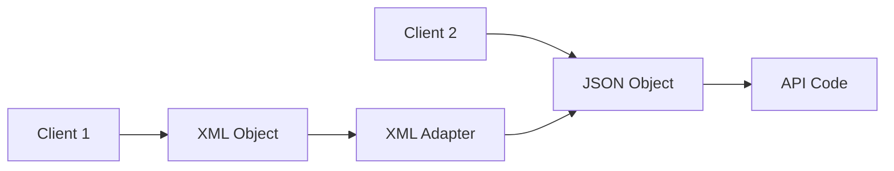

## Adapter

> The adapter pattern is a structural pattern that allows objects with incompatible interfaces to collaborate.

We come across adapters in our day to day life. For example, we have a 3 pin plug and we want to use it in a 2 pin socket. We can use an adapter to convert the 3 pin plug to a 2 pin plug. 

So, we use an adapter to allow two incompatible interfaces to work together.
Similarly, in software development, we have two incompatible interfaces and we want to use them together. We can use an adapter to convert one interface to another. For instance, we have an API that returns a list of users. Now the request to this API requires a JSON object. Some clients instead of sending a JSON object, want to send an XML object. 

Should we change the API to accept an XML object? Should we create a new API that accepts an XML object? No, that would be redundant. This is where the adapter pattern comes into play. We can create an adapter that converts the XML object to a JSON object and then use the existing API.



You can create an adapter. This is a special object that converts the interface of one object so that another object can understand it.

An adapter wraps one of the objects to hide the complexity of conversion happening behind the scenes. The wrapped object isn’t even aware of the adapter. For example, you can wrap an object that operates in meters and kilometers with an adapter that converts all of the data to imperial units such as feet and miles.

Adapters can not only convert data into various formats but can also help objects with different interfaces collaborate. Here’s how it works:

* The adapter gets an interface, compatible with one of the existing objects.
* Using this interface, the existing object can safely call the adapter’s methods.
* Upon receiving a call, the adapter passes the request to the second object, but in a format and order that the second object expects.

### Problem

Let us take the example of payment processing.
As a part of our application we want to integrate with different payment gateways.
We first use the Stripe payment gateway. The stripe team provides us with a library that we can use to integrate with their payment gateway.

```java
public class StripeApi {
    public void createPayment() {
        // Create payment
    }

    public PaymentStatus checkStatus(String paymentId) {
        // Check payment status
    }
}
```

We use the Stripe API to create a payment and check the status of the payment.

```java
public void processPayment() {
    StripeApi stripeApi = new StripeApi();
    Payment object = stripeApi.createPayment();
    PaymentStatus status = stripeApi.checkStatus(object.getId());
}
```

Now we want to integrate with another payment gateway. We use the PayPal payment gateway. The PayPal team provides us with a library that we can use to integrate with their payment gateway.

```java
public class PayPalApi {
    public void makePayment() {
        // Create payment
    }

    public PaymentStatus getStatus(String paymentId) {
        // Check payment status
    }
}
```

As you can see, the Stripe API and the PayPal API have different method names. The Stripe API uses `createPayment` and `checkStatus` while the PayPal API uses `makePayment` and `getStatus`.
Should we change where we use the Stripe API to use the PayPal API? No, that would be redundant. That would require us to change the code in multiple places. Apart from the additional work, it would also increase the chances of introducing bugs. Also, when we want to switch back to the Stripe API, we would have to change the code again. Hence, our code is also violating SRP and OCP. We are also using concrete classes instead of interfaces. This makes our code tightly coupled.

### Implementation

1. `Incompatible classes` - You should have two classes that have incompatible interfaces. For example, the Stripe API and the PayPal API.
```java
public class StripeApi {
    public void createPayment() {
        // Create payment
    }

    public PaymentStatus checkStatus(String paymentId) {
        // Check payment status
    }
}

public class PayPalApi {
    public void makePayment() {
        // Create payment
    }

    public PaymentStatus getStatus(String paymentId) {
        // Check payment status
    }
}
```

2. `Adapter interface` - Create an interface for the adapter that will be used to convert the incompatible interfaces.
```java
public interface PaymentProvider {
    void makePayment();
    PaymentStatus getStatus(String paymentId);
}
```

3. `Concrete adapter classes` - Create a class that implements the target interface. This is the class that the client code expects to work with. The adapter will convert the interface of the existing class to this interface.
```java
public class StripeAdapter implements PaymentProvider {

    @Override
    public void makePayment() {
        ...
    }

    @Override
    public PaymentStatus getStatus(String paymentId) {
        ... 
    }
}

public class PayPalAdapter implements PaymentProvider {

    @Override
    public void makePayment() {
        ...
    }

    @Override
    public PaymentStatus getStatus(String paymentId) {
        ... 
    }
}
```

4. `Transform request and delegate to original class` - In the adapter class, transform the request to the format that the original class expects. Then, call the original class to perform the operation.
```java
public class StripePaymentProvider implements PaymentProvider {

    private StripeApi stripeApi = new StripeApi();

    @Override
    public void makePayment() {
        stripeApi.createPayment();
    }

    @Override
    public PaymentStatus getStatus(String paymentId) {
        StripeStatus status =  stripeApi.checkStatus(paymentId);
        return convertStatus(status);
    }
}
```

5. `Client code` - The client code expects to work with the target interface. The client code doesn’t know that the adapter is converting the interface of the original class.
```java
public class PaymentProcessor {
    private PaymentProvider paymentProvider;

    public PaymentProcessor(PaymentProvider paymentProvider) {
        this.paymentProvider = paymentProvider;
    }

    public void processPayment() {
        paymentProvider.makePayment();
        PaymentStatus status = paymentProvider.getStatus("paymentId");
    }
}
```

### Advantages
* You can use adapters to reuse existing classes with incompatible interfaces.
* You can even modify the request and response of the original classes.
* Single Responsibility Principle. You can separate the interface or data conversion code from the primary business logic of the program.
* Open/Closed Principle. You can introduce new types of adapters into the program without breaking the existing client code, as long as they work with the adapters through the target interface.

